# Dandelion Simulation
> Posted on **2018-03-02 11:18:47**    Original author: **Quentin Le Sceller**

This document describes a network of node with Dandelion.

In this scenario, we simulate a successfull aggregation but a failed transaction cut-through forcing a node to revert its stempool state.

This document also helps visualizing all the timers in a simple way.

## T = 0 - Initial Situation

## T = 5

A sends grins to B.
B flips a coin and decides to add it to its stempool and starts the embargo timer for this transaction.

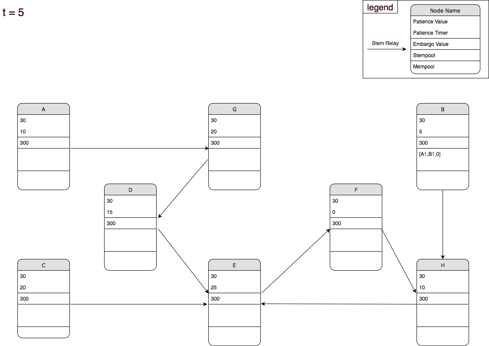

## T = 10

B waits until he runs out of patience.

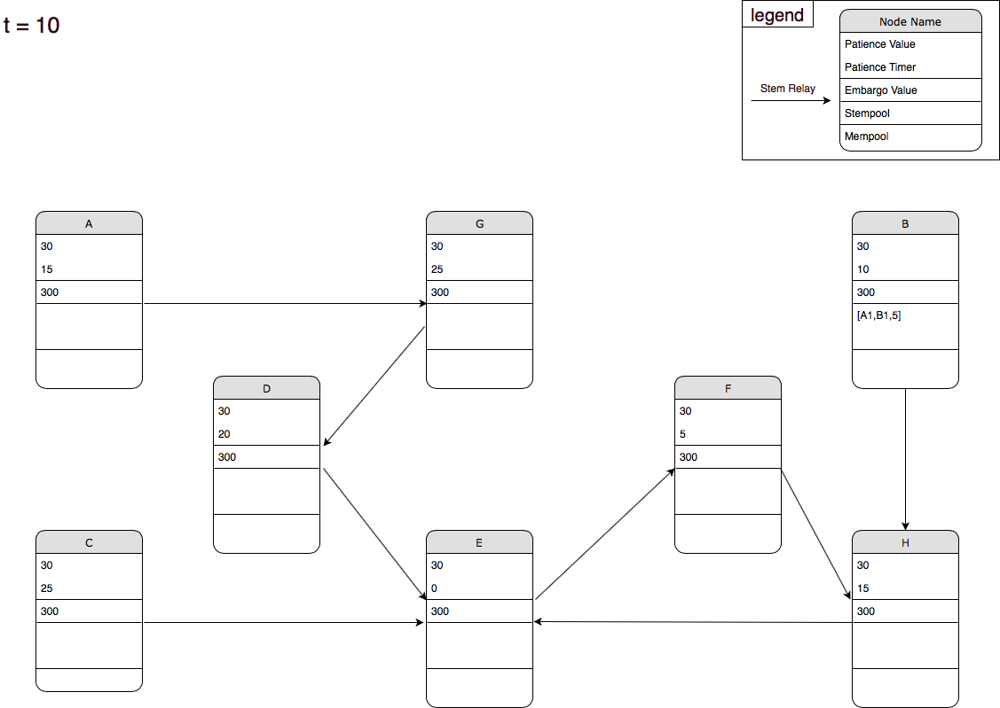

## T = 30

B runs out of patience and broadcasts the aggregated stem transaction to its Dandelion relay H.
H receives the stem transaction, flips a coin and decides to add it to its stempool and starts the embargo timer for this transaction.

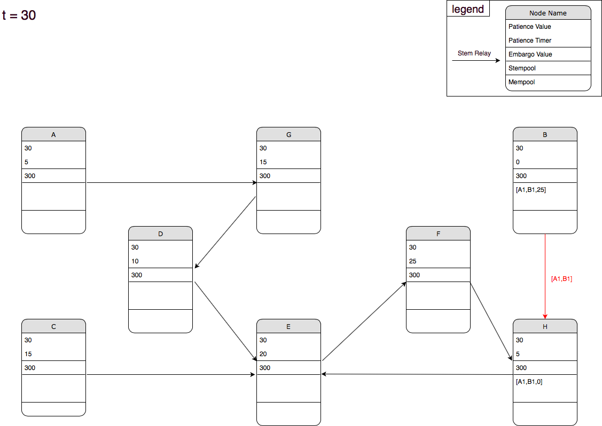

## T = 40

G sends grins to E.
E flips a coin and decides to add it to its stempool and starts the embargo timer for this transaction.
B and H wait.

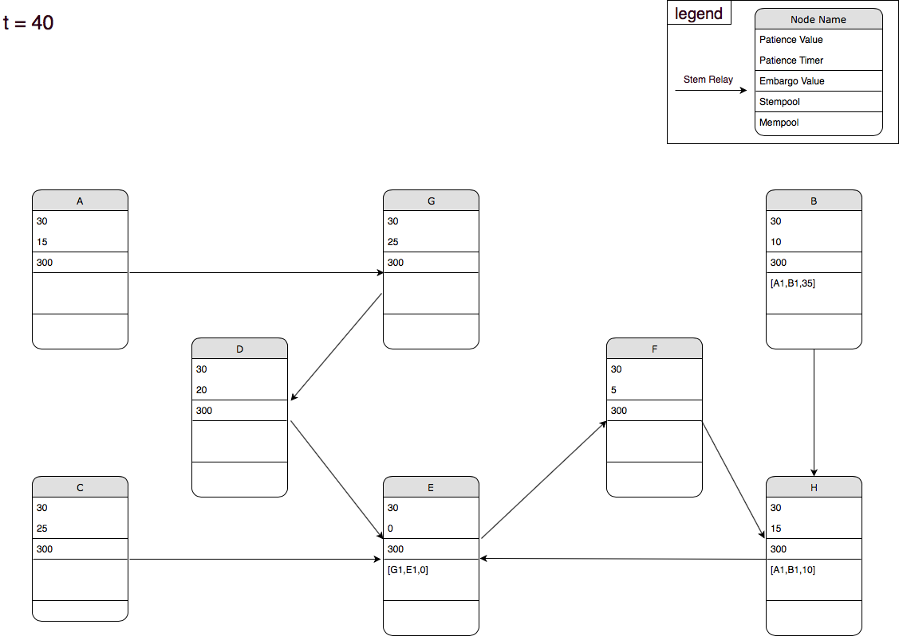

## T = 55

B spends B1 to D.
D flips a coin and decides to add it to its stempool and starts the embargo timer for this transaction.
H runs out of patience broadcasts the aggregated stem transaction to its Dandelion relay E.
E receives the stem transaction, flips a coin and decides to add it to its stempool and starts the embargo timer for this transaction.

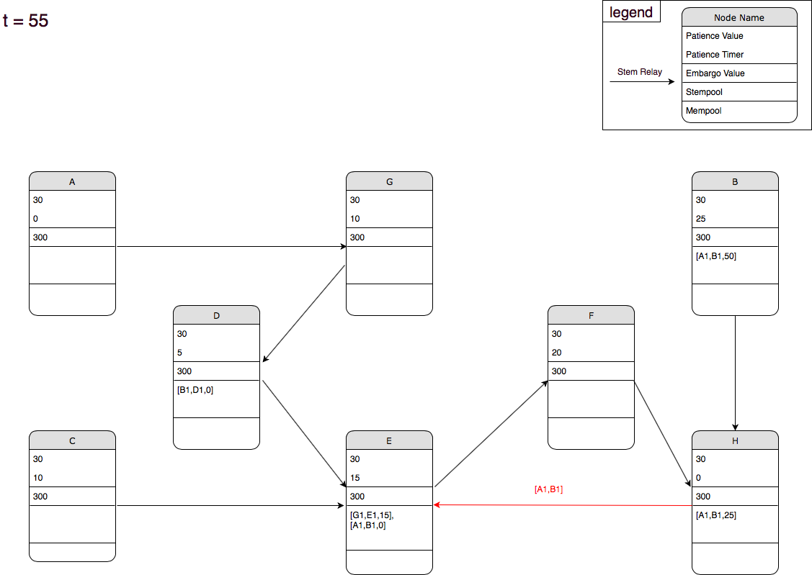

## T = 65

Nodes are waiting.

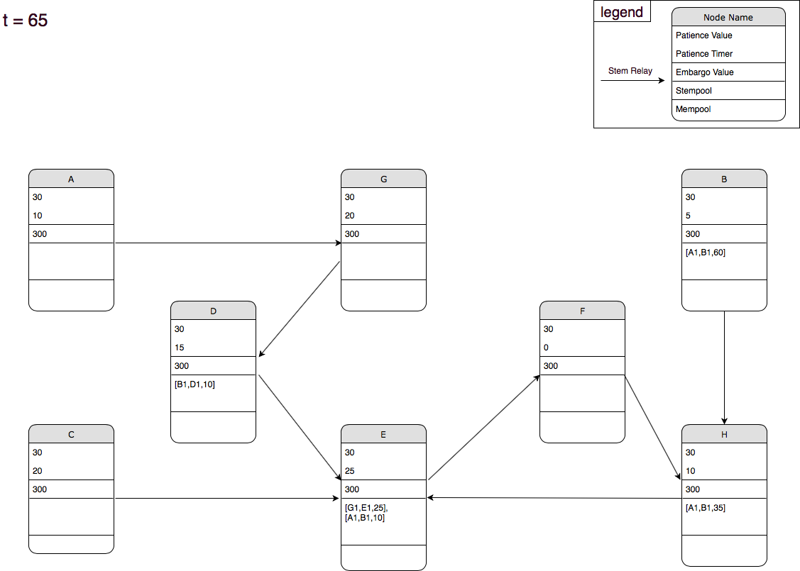

## T = 70

E runs out of patience broadcasts the aggregated stem transaction to its Dandelion relay F.
F receives the stem transaction, flips a coin and decides to add it to its stempool and starts the embargo timer for this transaction.

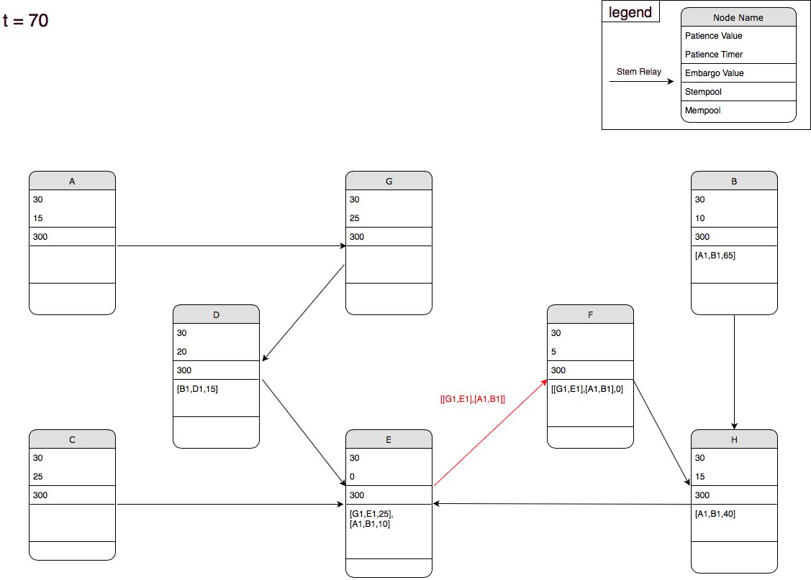

## T = 80

D runs out of patience, broadcasts the aggregated stem transaction to its Dandelion relay.
E receives the stem transaction, flips a coin and decides to add it to its stempool and starts the embargo timer for this transaction. aggregates them (thus removing duplicate input/output pair B1) and starts its patience timer.

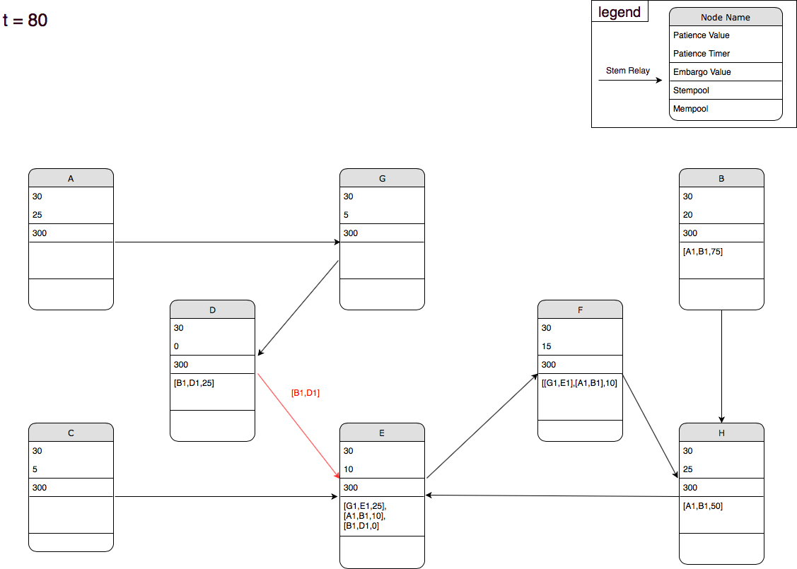

## T = 85

Nodes are waiting.

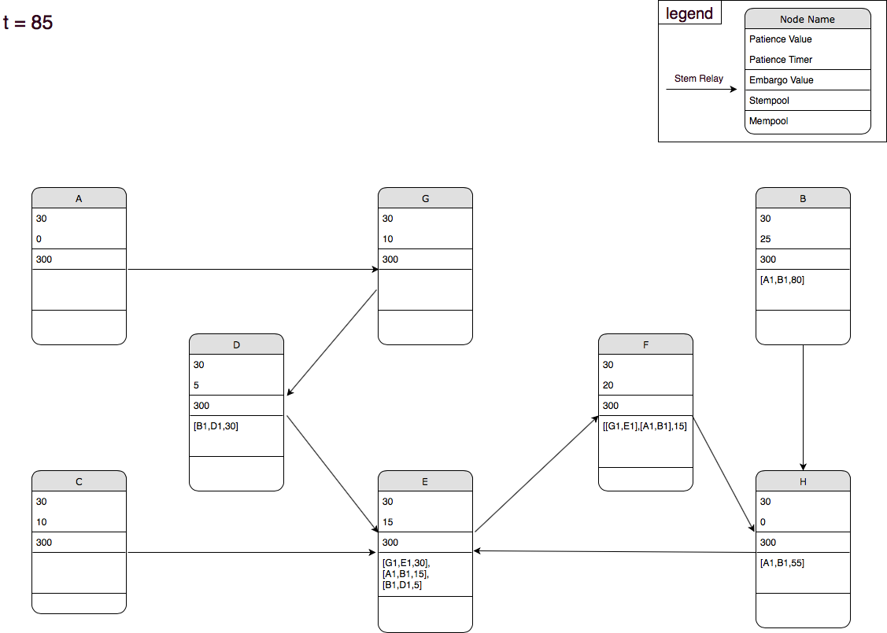

## T = 95 - Step 1

F runs out of patience, broadcasts the aggregated stem transaction to its Dandelion relay H.
H receives the transaction, flips a coin and decide to broadcast the transaction to all its peers (fluff in the mempool).

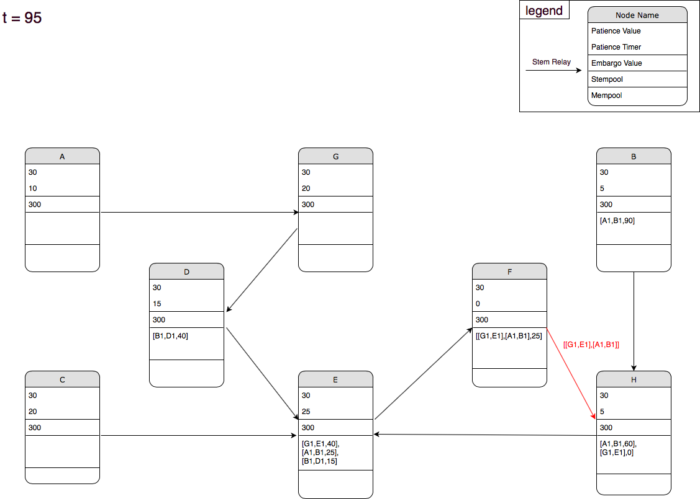

## T = 95 - Step 2

All the nodes add this transaction to their mempool and remove the related transactions from their stempool.
E receives the transaction in its mempool and reverts the state of its stempool to avoid conflicting transactions.

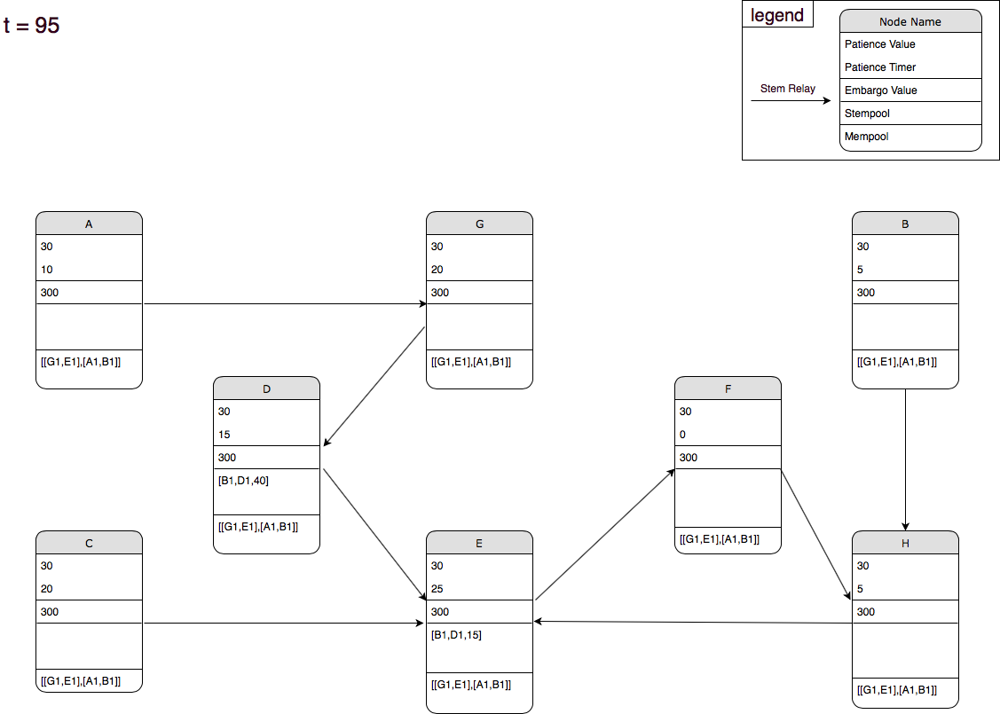
